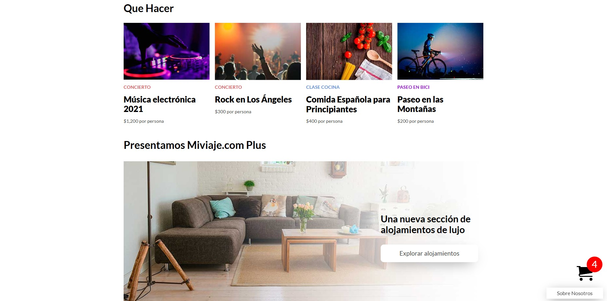
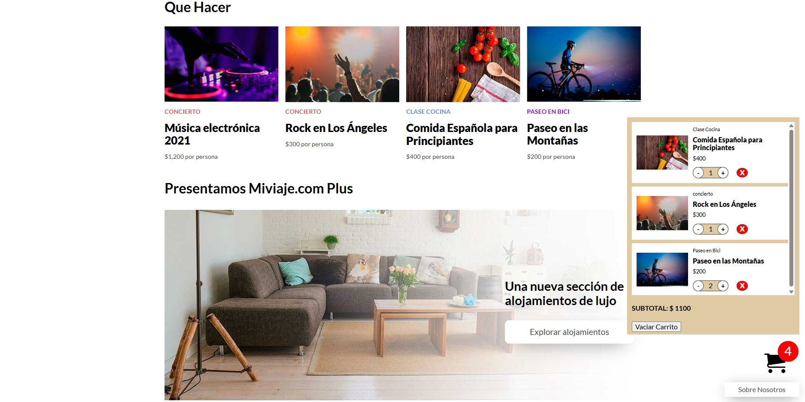

# Booking App

A web-based booking application that allows users to browse services, add them to a shopping cart, and view the subtotal in real time.

## Features
- Add and remove services from the cart.
- Automatic quantity updates.
- Dynamic subtotal calculation.
- Responsive and user-friendly interface.

## Technologies Used
- HTML5
- CSS3
- JavaScript (ES6+)

## How to Run It
1. Clone the repository.
2. Open `index.html` in your browser.

## Screenshots

### Landing Page

### Main Content

### Cart Drawer

